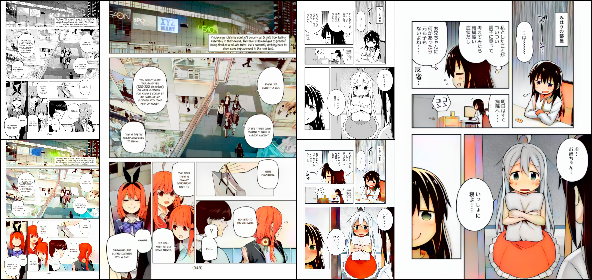

# inkn'hue: Enhancing Manga Colorization from Multiple Priors with Alignment Multi-Encoder VAE

[](https://github.com/rossiyareich/inknhue/blob/main/LICENSE)

[arXiv preprint]() | [Hugging Face](https://huggingface.co/rossiyareich/inknhue)

<p align="center">
  
<br>
<em><b>Examples of original grayscale inputs (top-left) and rough color inputs (bottom-left).</b> Final colorizations (right) are from our multi-encoder VAE outputs blended with rough color inputs in CIELAB color space</em>
</p>

This repository contains the official PyTorch implementation of [inkn'hue]()

> **inkn'hue: Enhancing Manga Colorization from Multiple Priors with Alignment Multi-Encoder VAE**<br>
> 
> **Abstract:** *Manga, a form of Japanese comics and distinct visual storytelling, has captivated readers worldwide. Traditionally presented in black and white, manga's appeal lies in its ability to convey complex narratives and emotions through intricate line art and shading. Yet, the desire to experience manga in vibrant colors has sparked the pursuit of manga colorization, a task of paramount significance for artists. However, existing methods, originally designed for line art and sketches, face challenges when applied to manga. These methods often fall short in achieving the desired results, leading to the need for specialized manga-specific solutions. Existing approaches frequently rely on a single training step or extensive manual artist intervention, which can yield less satisfactory outcomes. To address these challenges, we propose a specialized framework for manga colorization. Leveraging established models for shading and vibrant coloring, our approach aligns both using a multi-encoder VAE. This structured workflow ensures clear and colorful results, with the option to incorporate reference images and manual hints.*

## Prerequisites
- opencv-contrib-python>=4.1.0.25
- tensorflow>=2.12.0 (for batch Style2Paints inference)
- gradio>=3.20.1
- scikit-learn>=0.23.1
- scikit-image>=0.14.5
- tqdm
- numpy<1.24
- torch>=2.0.1
- torchvision>=0.15.2
- rich
- matplotlib
- einops
- Pillow
- accelerate
- omegaconf
- wandb
- huggingface-hub
- taming-transformers

## Setup
1. Clone this repository:
``` shell
git clone https://github.com/rossiyareich/inknhue.git
cd inknhue
```
2. Setup conda environment with Python 3.10 and cudatoolkit>=11.8
``` shell
conda env create -f environment.yaml
conda activate inknhue
```
3. Download model parameters from Hugging Face
``` shell
rm -r models
git lfs install
git clone https://huggingface.co/rossiyareich/inknhue models
```

## Inference using Gradio
From the project root folder, run this shell command:
``` shell
python app.py
```
Then access the app [locally](http://127.0.0.1:7860) with a browser.

You'll need your original b&w manga and a Style2PaintsV4.5 colorized version for the model inputs. The model performs best with `blended_smoothed_careless` priors.
Learn more about Style2Paints here: [lllyasviel/style2paints](https://github.com/lllyasviel/style2paints)

# Pipeline
<p align="center">
  
<br>
<em><b>Expanded overview of the framework.</b> Our pipeline utilizes trained parameters from related works including Style2Paints (shown in green), manga-colorization-v2 (shown as "Shading generator"), and Tag2Pix extractor (shown as "SEResNeXt LFE" (Local Feature Extractor)). The framework aligns results from the shading generator (shaded grayscale) and Style2Paints (rough-colored) using an alignment variational autoencoder and an auxiliary alignment encoder (shown in violet). The input consists of the original pages (bottom-leftmost), along with the color hints and/or reference images (top-leftmost) that are to be used as local and global color hints, respectively. The outputs from the last-stage model are then interpolated with the rough-colored outputs (shown in red) based on a user-defined interpolation value to produce the most appealing final colorized results (top-rightmost).</em>
</p>
<p align="center">
  
<br>
<em><b>Overview of the stages of our colorization framework.</b> Starting with the original image (1), the shading model generates a shaded grayscale version (3). Alongside this, the colorization model produces an initial rough-colored version (4) guided by additional cues provided by user-inputted color hints and/or a reference image (2). The combination model combines both the shaded (3) and rough-colored (4) stages, interpolating colors from the latter to produce the final colorization result (5).</em>
</p>

# Architecture
<p align="center">
  
<br>
<em><b>Architectural diagram of the alignment multi-encoder variational autoencoder.</b> The number of feature dimensions of the output are depicted at the top, while the input resolutions are indicated at the bottom of each subnetwork block.</em>
</p>

## Results
<p align="center">
  
<br>
<em><b>Significance of the generator.</b> Detail lost from the Style2Paints process are restored, and more accurrate shading is achieved.</em>
</p>
<p align="center">
  
<br>
<em><b>Significance of post-processing.</b> The generator may desaturate or overcorrect for inaccurate colors without post-processing.</em>
</p>
<p align="center">
  
<br>
<em><b>Qualitative comparison.</b> Additional outputs from each model stage and comparisons to manga-colorization-v2 are shown.</em>
</p>
<p align="center">
  
<br>
<em>Additional colorization results are shown.</em>
</p>
<p align="center">
  
<br>
<em>Additional colorization results are shown.</em>
</p>
<p align="center">
  
<br>
<em>Additional colorization results are shown.</em>
</p>
<p align="center">
  
<br>
<em>Additional colorization results are shown.</em>
</p>

## BibTeX
If you use our work in your research, please cite our arXiv article:
```

```
